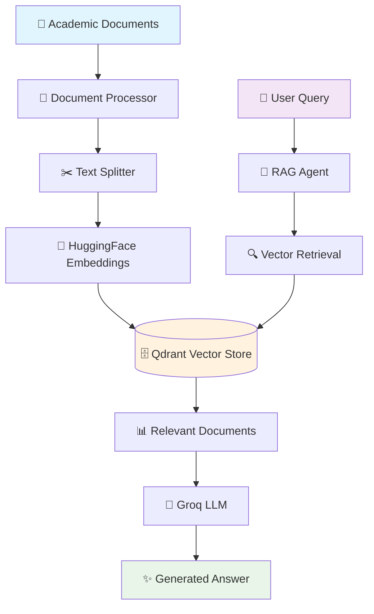

# 🎓 RAG Agent: Intelligent University Policy Assistant

<div align="center">


**An intelligent RAG (Retrieval-Augmented Generation) agent that answers university policy questions using advanced document retrieval and AI reasoning.**

[🚀 Quick Start](#-quick-start) • [📋 Features](#-features) • [🏗️ Architecture](#️-architecture) • [🛠️ Usage](#️-usage) • [📊 Examples](#-examples)

</div>

---

## 🌟 What is RAG Agent?

RAG Agent is a sophisticated question-answering system that combines the power of **vector databases** and **large language models** to provide accurate, contextual answers about university policies, course requirements, and academic procedures.

### 🎯 Key Capabilities

- 📚 **Document Understanding**: Processes complex academic documents (markdown format)
- 🔍 **Semantic Search**: Uses advanced embeddings for context-aware retrieval
- 🤖 **Intelligent Reasoning**: Leverages Groq's LLaMA 3 model for nuanced responses
- 🔄 **Hybrid Search**: Combines vector similarity with intelligent filtering
- 💬 **Natural Conversation**: Maintains context across multi-turn conversations

---

## 🏗️ Architecture Overview



### 🔧 Technology Stack

| Component | Technology | Purpose |
|-----------|------------|---------|
| **Vector Database** | 🗄️ Qdrant | Stores and retrieves document embeddings |
| **Embeddings** | 🤗 HuggingFace (`BAAI/bge-small-en-v1.5`) | Converts text to semantic vectors |
| **LLM** | 🚀 Groq LLaMA 3 (70B) | Generates intelligent responses |
| **Framework** | 🦜 LangChain + LangGraph | Orchestrates the RAG pipeline |
| **Text Processing** | 📝 Unstructured | Handles markdown document parsing |

---

## 📋 Features

### 🎯 Core Features
- ✅ **Semantic Document Search** - Find relevant policy sections using meaning, not just keywords
- ✅ **Context-Aware Responses** - Understands complex academic scenarios and relationships
- ✅ **Multi-format Support** - Processes structured academic documents (currently Markdown)
- ✅ **Persistent Vector Storage** - Efficient caching and retrieval of document embeddings
- ✅ **Tool-Based Architecture** - Modular design with specialized retrieval tools

### 🚀 Advanced Capabilities
- 🔄 **Hybrid Search Strategy** - Combines multiple retrieval techniques
- 🎨 **Rich Console Output** - Colorized debugging and progress tracking
- 🧩 **Modular Design** - Easy to extend with new document types or retrieval methods
- 🔧 **Configurable Parameters** - Adjust chunk sizes, embedding models, and retrieval settings

---

## 🚀 Quick Start

### 📋 Prerequisites

- Python 3.13+
- Qdrant server (local or cloud)
- Groq API key

### 🛠️ Installation

1. **Clone the repository**
   ```bash
   git clone <repository-url>
   cd rag-agent
   ```

2. **Install dependencies**
   ```bash
   pip install -e .
   ```

3. **Set up environment variables**
   ```bash
   # Create .env file
   echo "GROQ_API_KEY=your_groq_api_key_here" > .env
   ```

4. **Start Qdrant server**
   ```bash
   # Using Docker
   docker run -p 6333:6333 qdrant/qdrant
   
   # Or install locally
   # Follow: https://qdrant.tech/documentation/quick-start/
   ```

5. **Run the agent**
   ```bash
   python main.py
   ```

---

## 🛠️ Usage

### 🎯 Basic Usage

```python
from main import run_agent

# Ask a question about university policies
answer = run_agent("What are the eligibility criteria for final exams?")
print(answer)
```

### 🔧 Advanced Configuration

```python
from hybrid_search import load_or_create_vectore_store

# Customize the vector store
vector_store = load_or_create_vectore_store()
retriever = vector_store.as_retriever(search_kwargs={"k": 5})  # Get top 5 results

# Query specific topics
results = retriever.invoke("OPPE exam requirements")
```

### 📊 Document Processing

The system automatically processes your academic documents:

```python
# Documents are processed with these settings:
CHUNK_SIZE = 1000        # Characters per chunk
CHUNK_OVERLAP = 300      # Overlap between chunks
EMBEDDING_MODEL = "BAAI/bge-small-en-v1.5"  # Semantic embeddings
```

---

## 📊 Examples

### 🎓 Academic Queries

**Query**: *"What are the eligibility requirements for OPPE exams?"*

**Response**: 
> Based on the university policies, there are two main OPPE eligibility requirements:
> 
> **For OPPE 1:**
> - Students must complete the OPPE System Compatibility Test (SCT) exam
> - OPPE1 will not be scheduled for students who fail to complete the SCT
> 
> **For OPPE 2:**
> - Most courses have specific eligibility criteria
> - If you don't meet the final exam eligibility, OPPE2 won't be scheduled
> - You would receive a WA/WQ grade and need to repeat the entire course

### 📚 Course Information

**Query**: *"I got low marks in MAD1, should I move to MAD2 or repeat?"*

**Response**:
> Based on the course structure, you should **not** move to MAD2 if you got low marks in MAD1. Here's why:
> 
> - **MAD1 Project is a co-requisite** for MAD2 Theory
> - You need to successfully complete MAD1 before progressing
> - Consider repeating MAD1 to build a solid foundation
> - The diploma pathway shows MAD1 → MAD1 Project → MAD2 Theory → MAD2 Project

---

## 🔧 Configuration

### 📁 Project Structure

```
rag-agent/
├── 📄 main.py              # Main agent orchestration
├── 🔍 hybrid_search.py     # Vector store management
├── 📋 pyproject.toml       # Project dependencies
├── 📊 data/
│   └── gradingdoc.md      # University policy document
├── 🔧 .env                # Environment variables
└── 📖 README.md           # This file
```

### ⚙️ Environment Variables

```bash
# Required
GROQ_API_KEY=your_groq_api_key

# Optional (with defaults)
QDRANT_HOST=localhost
QDRANT_PORT=6333
EMBEDDING_MODEL=BAAI/bge-small-en-v1.5
```

### 🎛️ Customizable Parameters

```python
# In hybrid_search.py
CHUNK_SIZE = 1000           # Adjust for longer/shorter contexts
CHUNK_OVERLAP = 300         # Control information continuity
EMBEDDING_DIMENSION = 384   # Match your embedding model
SEARCH_K = 3               # Number of retrieved documents
```

---

## 🐛 Troubleshooting

### Common Issues

| Issue | Solution |
|-------|----------|
| 🔴 **Qdrant Connection Error** | Ensure Qdrant server is running on `localhost:6333` |
| 🟡 **No documents found** | Check if `data/gradingdoc.md` exists and is readable |
| 🔵 **Groq API Error** | Verify your `GROQ_API_KEY` in `.env` file |
| 🟣 **Memory Issues** | Reduce `CHUNK_SIZE` or limit `search_k` parameter |

### 🔍 Debug Mode

Enable detailed logging by checking the colorized console output:

- 🔵 **Blue**: Model interactions
- 🟢 **Green**: Tool executions  
- 🟡 **Yellow**: Final answers
- 🔴 **Red**: Errors
- 🟣 **Purple**: Decision points

---

## 🤝 Contributing

We welcome contributions! Here are some ways to help:

- 📝 **Documentation**: Improve setup guides and examples
- 🔧 **Features**: Add new document types or retrieval methods
- 🐛 **Bug Fixes**: Report and fix issues
- 🧪 **Testing**: Add test cases for different scenarios

### 🔄 Development Workflow

1. Fork the repository
2. Create a feature branch: `git checkout -b feature/amazing-feature`
3. Make your changes
4. Add tests if applicable
5. Submit a pull request

---

## 📈 Roadmap

### 🎯 Upcoming Features

- [ ] 📱 **Web Interface** - User-friendly web UI
- [ ] 🔗 **Multi-Document Support** - Handle multiple policy documents
- [ ] 📊 **Analytics Dashboard** - Query analytics and performance metrics
- [ ] 🌐 **API Endpoints** - RESTful API for integration
- [ ] 🔄 **Real-time Updates** - Auto-sync document changes
- [ ] 🎨 **Custom Themes** - Personalized UI themes

### 🚀 Performance Improvements

- [ ] ⚡ **Caching Layer** - Redis-based response caching
- [ ] 🔍 **Advanced Search** - Hybrid keyword + semantic search
- [ ] 📈 **Scalability** - Multi-instance deployment support

---

## 📄 License

This project is licensed under the MIT License - see the [LICENSE](LICENSE) file for details.

---

## 🙏 Acknowledgments

- 🤗 **HuggingFace** for excellent embedding models
- 🚀 **Groq** for lightning-fast LLM inference
- 🗄️ **Qdrant** for robust vector database capabilities
- 🦜 **LangChain** for the comprehensive AI framework

---

<div align="center">

**Built with ❤️ for the academic community**

[⭐ Star this repo](../../stargazers) • [🐛 Report Bug](../../issues) • [💡 Request Feature](../../issues)

</div>
