# 🧠 RAG Institute

<div align="center">

[](https://www.python.org/downloads/)
[](https://neo4j.com/)
[](https://streamlit.io/)
[](https://langchain.com/)
[](https://llamaindex.ai/)

*A sophisticated Retrieval-Augmented Generation system combining graph and vector databases for intelligent document analysis*

[Features](#-features) • [Installation](#-installation) • [Usage](#-usage) • [Architecture](#-architecture) • [API](#-api)

</div>

---

## 🚀 Features

### 🔍 **Hybrid Retrieval System**
- **Graph-based retrieval** using Neo4j for entity relationships
- **Vector similarity search** with embedding models
- **Combined retrieval** for comprehensive context

### 🤖 **AI-Powered Analysis**
- **Entity extraction** from scientific documents
- **Structured data parsing** with Pydantic models
- **Intelligent question answering** using LLMs

### 🌐 **Interactive Web Interface**
- **Streamlit-based chat interface** for real-time queries
- **File upload support** for PDF documents
- **Conversational history** with persistent sessions

### 📊 **Knowledge Graph Visualization**
- **Interactive graph visualization** using yFiles
- **Entity relationship mapping**
- **Document connection analysis**

---

## 🏗️ Architecture

```mermaid
graph TB
    A[📄 PDF Documents] --> B[🔄 Text Splitter]
    B --> C[🧠 LLM Graph Transformer]
    C --> D[📊 Neo4j Graph DB]
    
    B --> E[🔢 Embedding Model]
    E --> F[🗂️ Neo4j Vector Store]
    
    G[❓ User Query] --> H[🎯 Entity Extraction]
    H --> I[🔍 Graph Retriever]
    G --> J[🔍 Vector Retriever]
    
    I --> K[🤝 Hybrid Retrieval]
    J --> K
    K --> L[🤖 LLM Response]
    L --> M[💬 Streamlit Interface]
```



### Knowledge-graph


### Core Components

| Component | Technology | Purpose |
|-----------|------------|---------|
| **Graph Database** | Neo4j | Store entity relationships and document structure |
| **Vector Store** | Neo4j Vector | Semantic similarity search |
| **LLM** | Ollama (Llama 3.1) | Natural language processing and generation |
| **Embeddings** | Nomic Embed Text | Document and query vectorization |
| **Web Interface** | Streamlit | Interactive user interface |
| **Visualization** | yFiles Jupyter | Graph network visualization |

---

## 📦 Installation

### Prerequisites

- **Python 3.13+**
- **Neo4j Database** (local or cloud instance)
- **Ollama** with required models
- **Git**

### 1. Clone the Repository

```bash
git clone https://github.com/NevroHelios/rag-agent.git
cd rag-agent
```

### 2. Install Dependencies

```bash
# Install system certificates (required for Neo4j connection)
uv add pip-system-certs

# Install project dependencies
uv sync
```

### 3. Setup Ollama Models

```bash
# Install required models
ollama pull llama3.1:8b
ollama pull nomic-embed-text:latest
ollama pull gemma3n:latest  # optional
```

### 4. Environment Configuration

Create a `.env` file in the project root:

```env
# Neo4j Configuration
NEO4J_URI=bolt://localhost:7687
NEO4J_USERNAME=neo4j
NEO4J_PASSWORD=your_password
NEO4J_DATABASE=neo4j
NEO4J_INSTANCE_ID=your_instance_id  # for cloud instances

# Optional: OpenAI Configuration
OPENAI_API_KEY=your_openai_key
```

<!-- ### 5. Initialize Database

```bash
# Run the test script to verify setup
python test.py
``` -->

---

## 🎯 Usage

### Web Interface

Launch the Streamlit application:

```bash
uv run streamlit run main.py
```

Navigate to `http://localhost:8501` and:

1. **Upload Documents**: Use the sidebar to upload PDF files
2. **Ask Questions**: Type your questions in the chat interface
3. **View Responses**: Get AI-generated answers with source context

### Jupyter Notebook

Explore the system interactively:

```bash
jupyter notebook base.ipynb
```

### Programmatic Usage

```python
from chain import build_chain

# Initialize the RAG chain
chain = build_chain()

# Ask questions
response = chain.invoke("How to detect CME from particle activity in L1?")
print(response)
```

---

## 🔧 Configuration

### Entity Extraction Model

The system extracts various entity types from documents:

```python
class Entities(BaseModel):
    person: List[str]           # Authors, researchers
    organization: List[str]     # Universities, institutions
    topic: List[str]           # Key concepts, subjects
    publication: List[str]     # Citations, references
    location: List[str]        # Geographic locations
    date: List[str]           # Temporal information
    # ... and more specialized fields
```

### Retrieval Configuration

```python
# Vector search parameters
similarity_top_k = 5
similarity_threshold = 0.7

# Graph search parameters
entity_limit = 5
relationship_depth = 2
```

---

## 📊 Supported Document Types

| Format | Status | Notes |
|--------|--------|-------|
| **PDF** | ✅ Supported | Primary format with PyMuPDF |
| **TXT** | ✅ Supported | Plain text documents |
| **DOCX** | 🔄 Planned | Microsoft Word documents |
| **HTML** | 🔄 Planned | Web pages and articles |

---

## 🧪 Testing

### Run Test Suite

```bash
# Test Neo4j vector store functionality
python test.py

# Test existing database queries
python -c "from test import test_query_existing_database; test_query_existing_database()"
```

### Example Queries

- *"What is this document about?"*
- *"How to detect CME from particle activity in L1?"*
- *"What are the main findings in this research?"*
- *"Who are the authors of this paper?"*

---

## 🤝 Contributing

1. **Fork** the repository
2. **Create** a feature branch (`git checkout -b feature/amazing-feature`)
3. **Commit** your changes (`git commit -m 'Add amazing feature'`)
4. **Push** to the branch (`git push origin feature/amazing-feature`)
5. **Open** a Pull Request

---

## 📝 License

This project is licensed under the MIT License - see the [LICENSE](LICENSE) file for details.

---

## 🆘 Troubleshooting

### Common Issues

**Neo4j Connection Issues**
```bash
# Install system certificates
uv add pip-system-certs
```

**Ollama Model Not Found**
```bash
# Verify models are installed
ollama list
ollama pull <model-name>
```

**Memory Issues with Large Documents**
- Adjust `chunk_size` in text splitter
- Reduce `similarity_top_k` parameter
- Process documents in smaller batches

### Support

- 📖 **Documentation**: Check the inline code documentation
- 🐛 **Issues**: Report bugs via GitHub issues
- 💬 **Discussions**: Join community discussions

---

<div align="center">

**Built with ❤️ using LangChain, LlamaIndex, and Neo4j**

*Star ⭐ this repository if you find it helpful!*

</div>